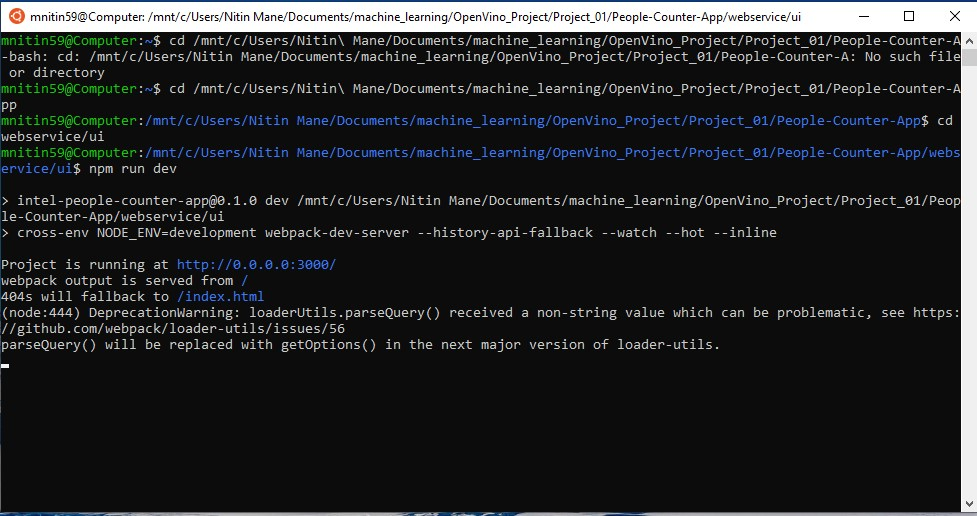
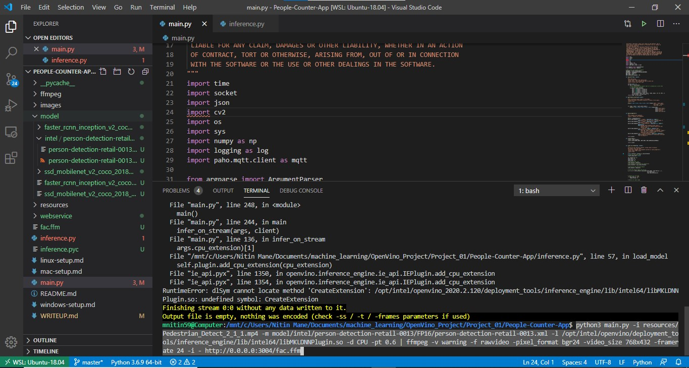

# People Counter App

## Windows wsl Linux ubuntu setup

I have followed the steps provided on windows-setup.md file. 

After process and install the OpenVINO on the Linux kernel I process with the implementing the applicatio on the computer.  

### Loading the Model

I have downloaded the tgz file in the model folder.


the model was downloaded after certain time.


After that the files are unzipped from the same folder. 


### Loading Non-Frozen Models to the Model Optimizer

After this the model is converted into the IR. 

```
python mo_tf.py --input_model frozen_inference_graph.pb --tensorflow_object_detection_api_pipeline_config pipeline.config --reverse_input_channels --tensorflow_use_custom_operations_config extensions/front/tf/ssd_v2_support.json
```


[Source](https://docs.openvinotoolkit.org/latest/_docs_MO_DG_prepare_model_convert_model_Convert_Model_From_TensorFlow.html)

### Downloading model for pre-requisite libraries

In this the OpenVINO is intialize for the using the model downloader. the pre-requisite libraries and source the openvino installation using the following commands:

```sh
 source /opt/intel/openvino/bin/setupvars.sh -pyver 3.5
```
and after that downloaded the person-detection-retail-0013 

```sh
 sudo ./downloader.py --name person-detection-retail-0013 --precisions FP16 -o <File-Location>
```


### App setup and service activation

Open a new terminal

Execute the following commands:

```sh
  cd webservice/server
  npm install
```
After installation, run:

```sh
  cd node-server
  node ./server.js
```

If succesful you should receive a message-

```sh
Mosca Server Started.
```


Open another terminal

These commands will compile the UI for you

```sh
cd webservice/ui
npm install
```

After installation, run:

```sh
npm run dev
```


If succesful you should receive a message-

```sh
webpack: Compiled successfully
```


Open another terminal and run:

This will set up the `ffmpeg` for you

```sh
sudo ffserver -f ./ffmpeg/server.conf
```

Finally execute the following command in another terminal

This peice of code specifies the testing video provided in `resources/` folder and run it on port `3004`


for the linux system the intel extension is different. There was no libcpu_extension_sse4.so in the file. 


At the final task run the main file from the visual code IDE. 

```sh
python main.py -i resources/Pedestrian_Detect_2_1_1.mp4 -m person-detection-retail-0013/FP32/person-detection-retail-0013.xml -l /opt/intel/openvino/deployment_tools/inference_engine/lib/intel64/libcpu_extension_sse4.so -d CPU -pt 0.6 | ffmpeg -v warning -f rawvideo -pixel_format bgr24 -video_size 768x432 -framerate 24 -i - http://0.0.0.0:3004/fac.ffm
```



This was the issue which took some time to cover.

After going through debugging the code.


#### Video 

[Video Link](https://youtu.be/L8jQufS6jZY)
[Updated video Link](https://youtu.be/1PGDqxg2Oh8)
