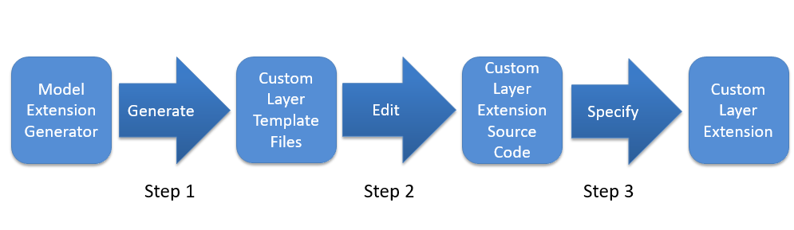

# Project - People Counter App

The People Counter App is an computer vision and AI application which work on the low latency edge hardware with optimization techniques. This application use Intel [OpenVino toolkit](https://software.intel.com/content/www/us/en/develop/tools/openvino-toolkit.html) for better performance and using model in application or production use.

## Explaining Custom Layers in the project 

The OpenVino toolkit has the supports packages for neural network model which has layers like TensorFlow* and other multiple frameworks including Caffe*, MXNet*, Kaldi* and ONYX*. The layers have different list for the supported each frameworks. For more information [Supported Frameworks](https://docs.openvinotoolkit.org/latest/_docs_MO_DG_prepare_model_Supported_Frameworks_Layers.html)

The worksflow on OpenVino toolkit converting models in First case is to use the model optimizer searches for list of known layers for each in the input model. After that The inference engine loads the known layers from the model input in IR files and then specified device plugin that will search a list of layer implementations for the device hardware specified execution. If the model topology contains customs layers that are described in the layers for the device which results in the the Inference Engine believes for the layer to be unsupported and reports an error. This layers are required supported package or the layers for each device plugin that will help to get Inference Engine is given in the supported framework.

### Custom Layer Implementation Workflow

While implementing a pre-trained model's custom layers in the Intel OpenVINO toolkit it is essential to add extensions for both the Model Optimizer and the Inference Engine to work.

### Custom Layer Extensions for the Model Optimizer project

 The basic process to handle the Model Optimizer are mainly focused with the following things
 
 1. The Custom Layer Extractor
It is responsible for identifying the parameters from the custom layer operation and extracting each instance of the custom layer is stored in per instance and used by the layer operation before finally appearing in the output IR. The input layer parameters are unchanged and the case is proceed for the customzation.


 2. The Custom Layer Operations.
It is responsible for instructing the attributes for the custom layer by supporting and figuring the output shape for its boundaries on each occurrence for the custom layers.The command-line argument stated as `--mo-op`  described in the file generates a custom layer operation for the Model Optimizer is useful.


First the Model Optimizer is extracted for the information parameters so that the input model which includes the model layers topology of the parameters such as input and output format, etc., for each layers gets readout. futhermore the model is continue for optimizition for different known attributes of the layers which are interconnects and incompletely comes information stream from the layer operation giving subtleties including the shape of the output for each layer. At last the output to the model IR files needed is optimized model by the Inference Engine for model execution in application. 

### Custom Layer Extensions for the Inference Engine in project

The given figure descibe the essential stream for the optimizing inference featuring for two custom layer Extension to the CPU and GPU Modules, the Custom Layer CPU expansion and the Custom Layer GPU  for Extension


Each hardware device plugin includes a library for optimized implementations to execute known layer operations which must be extended to execute a custom layer. The custom layer extension is implemented according to the target device:

1. Custom Layer CPU Extension
A compiled shared library (`.so` or `.dll` binary) required for the CPU Plugin for executing the custom layer on the CPU.

2. Custom Layer GPU Extension
The OpenCL source code refer with (`.cl`) for the custom layer kernel that will be compiled to execute on the GPU along with a layer description file (`.xml`) needed by the GPU Plugin for the custom layer kernel.

#### Model Extension Generator 

The Model Extension Generator tool generates template source code files for each of the extensions needed by the Model Optimizer and the Inference Engine. The implementation of each extension, the template functions may need to be edited to fill-in details specific to the custom layer or the actual custom layer functionality itself.

##### Command-line

The Model Extension Generator is included in the Intel OpenVINO toolkit installation and is run using the command :

```
python3 /opt/intel/openvino/deployment_tools/tools/extension_generator/extgen.py
```

the script output will appear similar to executing the following arguments:

```
usage: You can use any combination of the following arguments:
Arguments to configure extension generation in the interactive mode:
optional arguments:
  -h, --help            show this help message and exit
  --mo-caffe-ext        generate a Model Optimizer Caffe* extractor
  --mo-mxnet-ext        generate a Model Optimizer MXNet* extractor
  --mo-tf-ext           generate a Model Optimizer TensorFlow* extractor
  --mo-op               generate a Model Optimizer operation
  --ie-cpu-ext          generate an Inference Engine CPU extension
  --ie-gpu-ext          generate an Inference Engine GPU extension
  --output_dir OUTPUT_DIR
                        set an output directory. If not specified, the current
                        directory is used by default.
```

#### Extension Workflow

The workflow for each generated extension follows the same basic steps:



Step 1: Generate: Use the Model Extension Generator to generate the Custom Layer Template Files.

Step 2: Edit: Edit the Custom Layer Template Files as necessary to create the specialized Custom Layer Extension Source Code.

Step 3: Specify: Specify the custom layer extension locations to be used by the Model Optimizer or Inference Engine.

this are major extension to the workflow for custom layers.

#### handling custom layers

Some of the potential reasons for handling custom layers are needs for developing new models based on the application oriented features and providing better realiablity on supporting layers for the research and development project and AI commerical uses cases.

## Comparing Model Performance

I have check with various model but followed with the [Intel OpenVino Model Zoo](https://github.com/tensorflow/models/blob/master/research/object_detection/g3doc/detection_model_zoo.md) due to the related documentation and better accuracy result in search.  

My methods to compare models before and after conversion to Intermediate Representations
were as based on the Udacity workspace and the windows system using wsl ubuntu for the running this project.

### Model parameters

The model which are taken from the 

| | Model Name | Model (Pre-Conversion)| Model (Post-Conversion) | Inference (Pre-Conversion)| Inference (Post-conversion)|
|-|-|-|-|-|-|
|SSD MobileNet V2 | 68.34 Mb| 60.05 Mb| 55 ms | 70 ms|
|SSD Coco faster RCNN Resnet50 | 56.47 mb| 55.41 Mb| 89 ms | 120 ms|
|SSD Coco faster RCNN Inception v2 | 56.47 Mb| 55.81 Mb| 58 ms| 60 ms| 

The difference between model accuracy pre- and post-conversion was the Model Optimizer is converting models to the Intermediate Representation which cannot be translated to existing Inference Engine layers. 

The size of the model pre- and post-conversion was based on the COCO-trained models. 

The inference time of the model pre- and post-conversion is described based on the given documentation and the running on the system.

## Assess Model Use Cases

Some of the potential use cases of the people counter app are as follows: 
1. Social Distancing tracking and person monitoring in public places. 

Due to pandemic issue for proper care and awareness. the counter app can be very helpful in the public domain most cases in the gardens, parks, hospital and medical shops for proper measuring distance and maintainig good decision tracks among people awareness on the movements.

* Distance measurement
* Calculating person in one frame 
* Area calculation wise alarm 
* Smart operation statergy 

2. Smart Queue Management

In many grocery shop the major problem is distacting lines and misaligning people in the queue system for cashing out the product. The device can help to open and close the queue line for better productivy in the aligning people in one by one cases in the directional path and monitors those who follows the rules.

* Shop queue management in malls and gocery stores
* Customer retention planning
* Smart time based queue system in heavy load duty cases

3. Smart Voting System

As this can helpful in the voting room as only one person can pass a vote and this can be used in the polling or system integration for better security areas.

* Government voting system
* Company voting management 
* Smart in and out office management system

1. Industrial Area

In the heavy lifting robots and dangeours places this can use use for detection person and alaraming the area.

* Die making room
* Spray printing machine room
* Radio-active area or nuclear plant
* Maintenance room  

5. Educational Institute

There is popular demands in the educational institute for adding cctv camera and the motion detection for monitoring students by passing area. The app can be majorly use by security and the head office management and use for various interactive case.

* Counting students in class
* Queue in the college area
* Library access area


## Assess Effects on End User Needs

Lighting, model accuracy, and camera focal length/image size have different effects on a
deployed edge model. The potential effects of each of these are as follows:

1. In the lighting drop of model accuracy there is poor case results which is negligible use in the application. The device quality and the performances does matters for passing the model.
2. The model accuracy may reduce in certain case and it affects on the performing precison task in the widely use operation. The model which are set on the training phases on cloud in the timelaspe where no use case of device can help to perform model update and use for better productivity.
3. Low quality camera which having focal length, wide angle lense or Infrared camera may provide bad quality images and video output which result on affecting on the model accuracy and detection. the major concerns can be using the auto focal lens and proper thresholding it can be solved the problem.

## Model Research

In investigating potential people counter models, I tried each of the following three models:

- Model 1: [SSD MobileNet V2]
  - [Model Source](http://download.tensorflow.org/models/object_detection/ssd_mobilenet_v2_coco_2018_03_29.tar.gz)
  - I converted the model to an Intermediate Representation with the following arguments as follow:

```
python mo_tf.py --input_model frozen_inference_graph.pb --tensorflow_object_detection_api_pipeline_config pipeline.config --reverse_input_channels --tensorflow_use_custom_operations_config extensions/front/tf/ssd_v2_support.json
```

  - The model was insufficient for the app because it was misclassifing person and no counts were detected. the person was not getting detected. 
  - I tried to improve the model for the app by using some transer learning and custom data training but it was not sufficent.
  
- Model 2: [SSD Coco faster RCNN Resnet50]
  - [Model Source](http://download.tensorflow.org/models/object_detection/faster_rcnn_resnet50_coco_2018_01_28.tar.gz)
  - I converted the model to an Intermediate Representation with the following arguments as follow: 

```
python mo_tf.py --input_model frozen_inference_graph.pb --tensorflow_object_detection_api_pipeline_config pipeline.config --reverse_input_channels --tensorflow_use_custom_operations_config extensions/front/tf/ssd_v2_support.json
```

  - The model was insufficient for the app because of the rcnn parameter. there were lots of the masking parameter and the other layers to layout for running this model. The time duration for detecting one person would take 250 ms which was not felixble for the application. the inference have reduce the accurary results.
  - I tried to improve the model for the app by reducing the layers and optimize the model parameters which affected on the accuracy.

- Model 3: [SSD Coco faster RCNN Inception v2]
  - [Model Source](http://download.tensorflow.org/models/object_detection/faster_rcnn_inception_v2_coco_2018_01_28.tar.gz)
  - I converted the model to an Intermediate Representation with the following arguments as follow:

```
python mo_tf.py --input_model frozen_inference_graph.pb --tensorflow_object_detection_api_pipeline_config pipeline.config --reverse_input_channels --tensorflow_use_custom_operations_config extensions/front/tf/ssd_v2_support.json
```

  - The model was insufficient for the app because it able to detect certain person but the inference time was taking more compared to the model 2. This result for the adding certain changes in the model which further misclassified the frames and it was no further use. 
  - I tried to improve the model for the app by changing layers and optimizing the model parameter which affected the whole model with no use case.


## Model for the people counter app

I have gone through all the model on the OpenVINO and the documentation. I found the following model working in the application. 

- Model 1: [pedestrian-detection-adas-0002]
 - [Model Source](https://docs.openvinotoolkit.org/latest/_models_intel_pedestrian_detection_adas_0002_description_pedestrian_detection_adas_0002.html) 

Pedestrian detection network based on SSD framework with tuned MobileNet v1 as a feature extractor.

* In this the model inference time goes average 78 to 120 ms. 
* The person detected in the normal condition
* The precision of the model is 80 %.

- Model 2: [person-detection-retail-0002]
- [Model Source](https://docs.openvinotoolkit.org/latest/person-detection-retail-0002.html)

This is a pedestrian detector based on backbone with hyper-feature + R-FCN for the Retail scenario.
* In this the model inference times goes average 58 to 80 ms. which is good compared to model 1. 
* The person detected at any angle and condition. 
* The precision of the model is 80 %.

- Model 3: [person-detection-retail-0013]
- [Model Source](https://docs.openvinotoolkit.org/latest/_models_intel_person_detection_retail_0013_description_person_detection_retail_0013.html)

It is based on MobileNetV2-like backbone that includes depth-wise convolutions to reduce the amount of computation for the 3x3 convolution block.
* In this the model inference times goes average 18 to 48 ms. This is the most accurate result.
* The person from single plane is detected in any condition. 
* The precision of the model is 88 %.

### Application running 

Please refer README.md file.

### Application running on the Edge 

Please refer MyDoc.md file.

### Reference 
1. Custom Layer Guide [link](https://docs.openvinotoolkit.org/latest/_docs_HOWTO_Custom_Layers_Guide.html)

2. OpenVINO Pre-trained model [link](https://docs.openvinotoolkit.org/2019_R1/_docs_Pre_Trained_Models.html)

3. R.  Berg,  “Real-time people  counting system  using  video camera”,  Department  of  Computer  Science and  Media Technology, Gjøvik University College, Norway, 2007.
